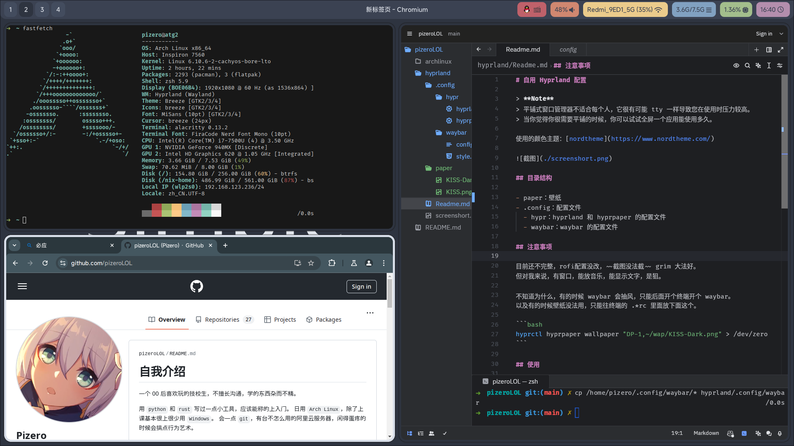

# 自用 Hyprland 配置

> **Note**
> 平铺式窗口管理器不适合每个人，它很有可能 tty 一样导致您在使用时压力较高。
> 当你觉得你很需要平铺的时候，你可以试试全屏一个应用能使用多久。

使用的颜色主题：[nordtheme](https://www.nordtheme.com/)



## 目录结构

- paper：壁纸，扔 ~/Pictures 文件夹下，或者去改 `hyprpaper.conf`
- .config：配置文件
  - hypr：hyprland 和 hyprpaper 的配置文件
  - waybar：waybar 的配置文件

## 注意事项

目前还不完整，wofi 配置没改，~~截图没法截~~ grim 大法好。
但对我来说，有窗口，能放音乐，能显示文字，是狙。

不知道为什么，有的时候 waybar 会抽风，只能后面开个终端开个 waybar。
以及有的时候壁纸没法用，只能往终端的 .*rc 里面放下面这个。

```bash
hyprctl hyprpaper wallpaper "DP-1,~/wap/KISS-Dark.png" > /dev/zero
```

## 使用

文件往 `$HOME` 目录一扔完事。

软件列表:

- alacritty（终端）
- waybar（状态拦）
- nmtui（状态栏唤出的网络管理组件）
- htop（状态栏唤出的性能监视器）
- slurp 和 grim（截图）
- wofi（启动器）
- dolphin（文件管理器）
- firefox（浏览器）
- hyprland 和 hyprpaper 及其附属组件

## 设计思路

颜色照抄，边框选中的高亮就成，视线在哪纯粹就是对比。

剩下就纯纯个人喜好，waybar 下面画个圆角，还不错。
